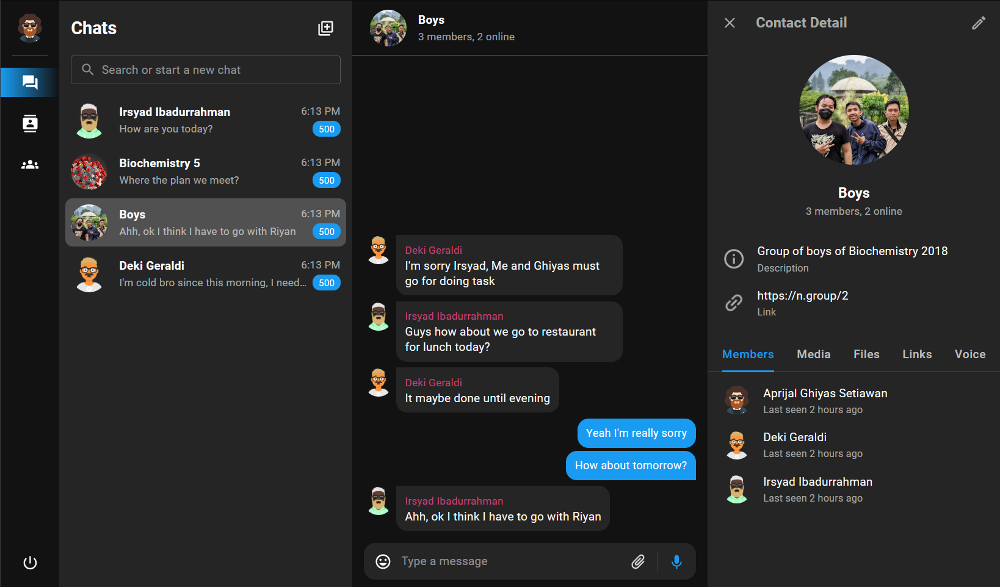
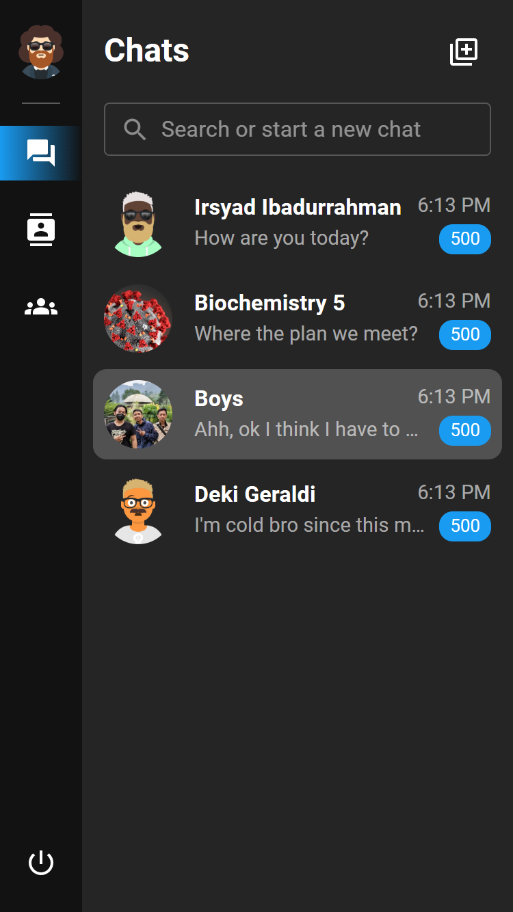
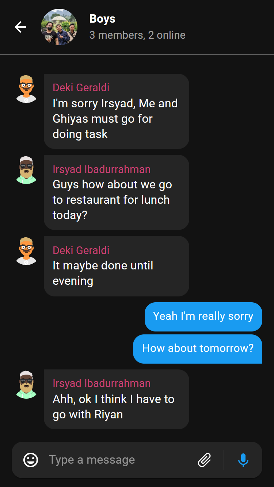

# Ngobrol (Real-Time Messaging Application)

This messaging application was built using Next JS framework for the frontend and Spring Boot framework for the backend.
To try to run the application on your local computer you need to install 
[Node.js 16](https://nodejs.org/), 
[Java 11](https://www.oracle.com/java/technologies/javase/jdk11-archive-downloads.html), and 
[Maven](https://maven.apache.org/download.cgi)

Clone the project by `git clone https://github.com/aprijal99/ngobrol-messaging-application.git`, and there are two folders, `ngobrol-frontend` and `ngobrol-web-socket`


<div align='center'>
    
    
</div>

## Build The Backend

Open your terminal and change the directory to `ngobrol-web-socket`, then execute the following commands line by line. The server will run on port `7080`

```bash
# Build the backend
mvn clean
mvn install package spring-boot:repackage

# Run the backend
java -jar ./target/ngobrol-web-socket-0.0.1-SNAPSHOT.jar
```

## Build The Fronted

Open your terminal and change the directory to `ngobrol-frontend`, then execute the following commands line by line. The server will run on port `3000`

```bash
# Build the frontend
npm install
npm run build

# Run the server
npm run start
```

## Usage

You can use two different browsers to try the functionality of the application. You can use two accounts already created or just sign up to create a new one

*First account*\
email: dekigeraldi@gmail.com\
password: ciater12345

*Second account*\
email: irsyadibadurrahman@gmail.com\
password: bekasi12345
